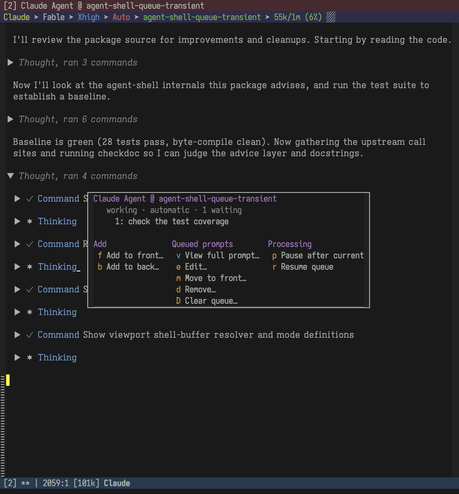

# agent-shell-queue-transient

A Transient menu for the prompt queue in agent-shell.



Features:

- Add to the front or the back of the queue.
- View, edit, or move a queued prompt to the front.
- Delete prompts, or clear the queue.
- Pause the queue after the current turn and resume it later.
- ... and more!

## Usage

Invoke `agent-shell-queue-transient` in an agent-shell buffer.

The entry command adapts to the queue:

- Busy with an empty queue: read a new prompt directly.
- Idle with an empty queue: move to the end of the shell input.
- Pending prompts or an explicitly paused queue: show the menu.

## Installation

Not on MELPA, but you can do:

```elisp
(use-package agent-shell-queue-transient
  :load-path "~/.emacs.d/packages/agent-shell-queue-transient"
  :after agent-shell
  :demand t
  :bind (:map agent-shell-mode-map
         ("C-<return>" . agent-shell-queue-transient)
         :map agent-shell-viewport-view-mode-map
         ("C-<return>" . agent-shell-queue-transient)
         :map agent-shell-viewport-edit-mode-map
         ("C-<return>" . agent-shell-queue-transient))
  :config
  (agent-shell-queue-transient-mode 1))
```

## Compatibility

Uses private agent-shell functions and its `:pending-prompts` state.  Upstream
changes may require updates here.

## Testing

With agent-shell and its dependencies installed:

```sh
EMACS_PACKAGE_DIR="$HOME/.local/emacs/elpa" \
AGENT_SHELL_DIR=/path/to/agent-shell \
emacs --batch -Q -l tests/run-tests.el
```

## License

GPL-3.0-or-later.
